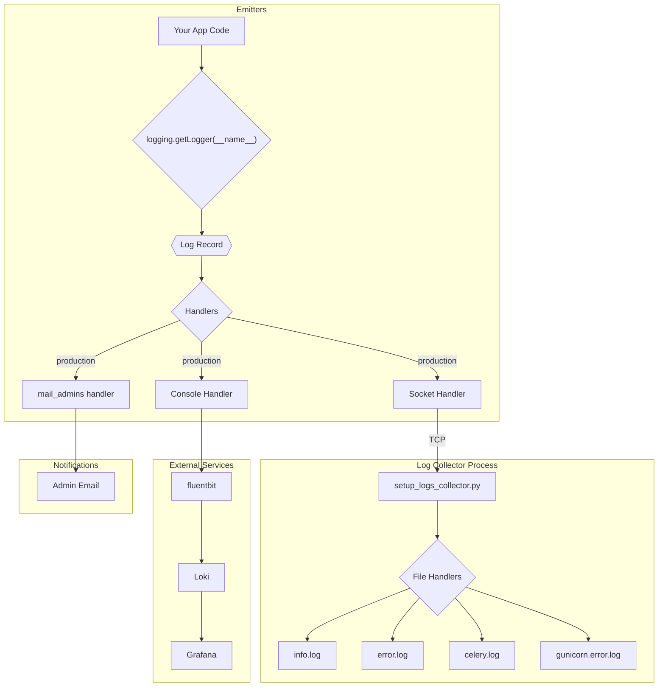
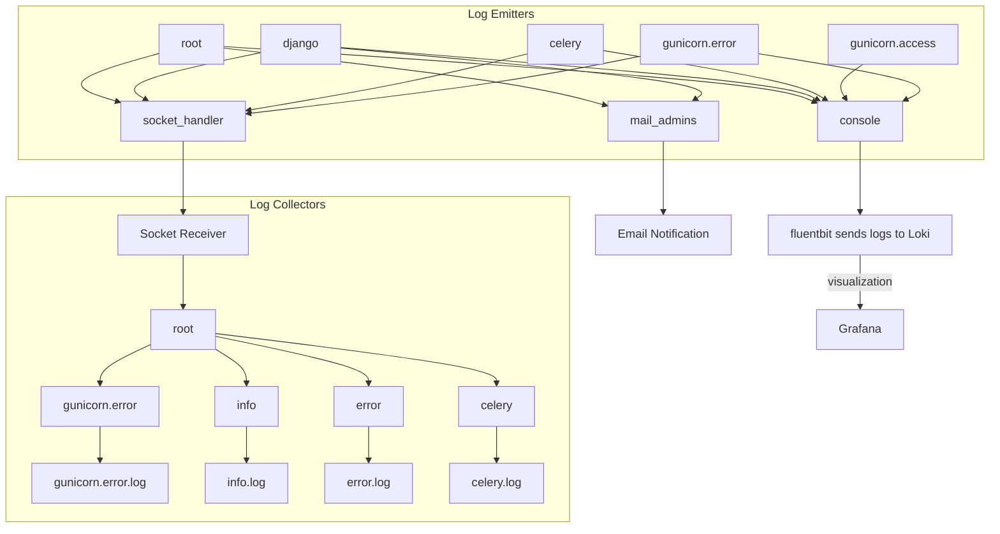

# Logging in Cohort360-Back-end

For production deployments, **Cohort360-Back-end** is designed to run in a multi-process mode (e.g., with multiple Gunicorn or Celery workers). This introduces a challenge: multiple processes cannot safely write to the same log file simultaneously, which is a known limitation in Python's standard logging library.

## Architecture Overview

To address this, we use a robust, socket-based logging architecture that ensures log integrity and central management.

1.  **Log Emitters**: All application processes (Gunicorn workers, Celery workers) are configured with a `socket_handler`. They do not write to files directly. Instead, they serialize log records and send them over a TCP socket.
2.  **Log Collector**: A single, dedicated process runs the **`setup_logs_collector.py`** script. This script listens on the TCP socket, receives log records from all emitters, and is the *only* process that writes them to the final log files (`info.log`, `error.log`, etc.).

This emitter/collector design prevents log corruption and ensures that all logs from distributed processes are handled centrally.

## How to Log

To add logging to your code, get a logger instance for the current module and use its methods. The `root` logger is configured to handle all logs from within the project apps, so you don't need to configure a new logger.

**Example:**
```python
import logging

# Get a logger for the current file
logger = logging.getLogger(__name__)

def my_function():
    logger.info("Starting my_function.")
    try:
        # ... some logic that might fail
        result = 1 / 0
    except Exception:
        # Use exc_info=True to automatically include exception details in the log.
        logger.error("An error occurred in my_function", exc_info=True)
    
    logger.warning("This is a warning message.")
    logger.debug("This is a debug message.") # Won't show unless level is DEBUG
```

## Logging config

### Loggers
* `django`: Takes in charge logs coming from Django framework
* `celery`: Englobes logs from Celery
* `root`: Manages all other logs including those coming from unconfigured loggers or loggers created per module by: logging.getLogger(\_\_name\_\_) 

Other loggers are configured for Gunicorn at [gunicorn.conf.py](../.conf/gunicorn.conf.py)
* `gunicorn.access`: Logs requests
* `gunicorn.error`: Logs errors if any
* `root`: Logs other messages coming from unknown loggers within Gunicorn

### Handlers
* `console`: logs to stdout
* `socket_handler`: sends logs through a TCP socket. This is the main logger that solves the issue of writing logs to files vis-a-vis multiprocessing.
* `mail_admins`: sends email notifications to system admins (check `ADMINS` entry in [settings.py](../admin_cohort/settings.py)). this handles 
  logs with level `ERROR` or higher only

## Log files
Logs are stored in `project root`/log directory and split into 4 files:  
* `gunicorn.error.log`: contains Gunicorn related errors
* `celery.log`: contains Celery related logs
* `error.log`: contains logs with level `ERROR` or higher coming from Django, DRF, Celery, Gunicorn or the project apps
* `info.log`: contains info/warning logs from the project apps and packages

### Logging flow




