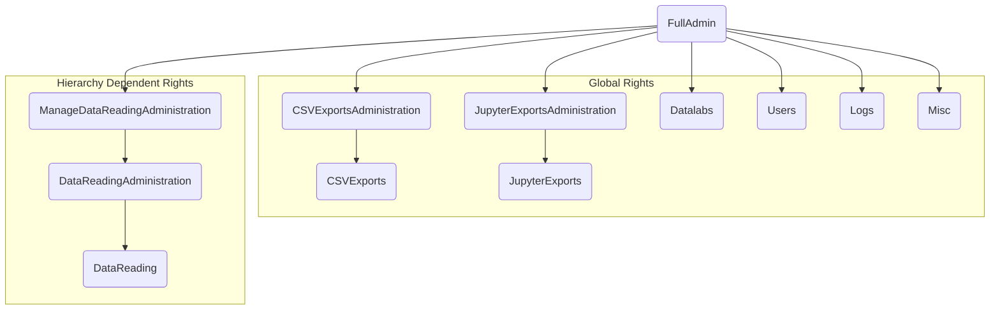
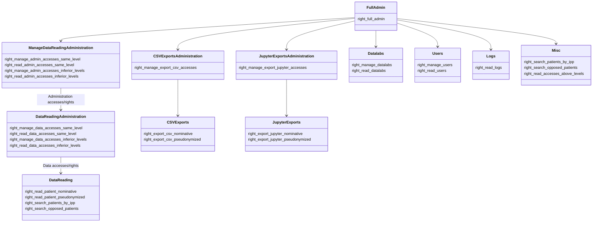

## 
## ℹ️ Any _access management_ right implicitly allows _reading_ as well

#### Full Admin Role:
this is a **Super User**role. It allows managing/reading everything, including managing all access.  
This role has the following right enabled:  
- *right_full_admin*
Only **one** Full Admin role is expected to be configured.

#### Data Reading Role:
It allows reading patient data and search by IPP and lookup opposing patients.  
It is any role having at least one of the following rights activated:  
- *right_read_patient_nominative*
- *right_read_patient_pseudonymized*
- *right_search_patients_by_ipp*
- *right_search_opposed_patients*

#### Data Reading Administration Role:
It allows to manage (hence read) accesses associated with Data Reading Roles.  
This is any role with at least one of the following rights enabled:  
- *right_manage_data_accesses_same_level*
- *right_read_data_accesses_same_level*
- *right_manage_data_accesses_inferior_levels*
- *right_read_data_accesses_inferior_levels*

#### Manage (Data Reading Administration) Role:
It allows to manage (hence read) accesses associated with Data Reading Administration Roles.  
This is any role with at least one of the following rights enabled:  
- *right_manage_admin_accesses_same_level*
- *right_read_admin_accesses_same_level*
- *right_manage_admin_accesses_inferior_levels*
- *right_read_admin_accesses_inferior_levels*

#### CSV Exports Role:
It allows to export data in CSV and XLSX formats.  
This is any role with at least one of the following permissions enabled:  
- *right_export_csv_nominative*
- *right_export_csv_pseudonymized*

#### Jupyter Exports Role:
It allows to export data in Hive formats to a Jupyter datalab or workspace.  
This is any role with at least one of the following permissions enabled:  
- *right_export_jupyter_nominative*
- *right_export_jupyter_pseudonymized*

#### Logs Reading Role:
It allows you to view logs on _Portail_.  
This is any role with the following permission enabled:  
- *right_read_logs*

#### User Role:
It allows you to manage/read the user list.  
It is any role with at least one of the following rights enabled:  
- *right_manage_users*
- *right_read_users*

#### Datalabs Role:
It allows you to manage/read the list of Datalabs.  
It is any role with at least one of the following permissions enabled:  
- *right_manage_datalabs*
- *right_read_datalabs*
