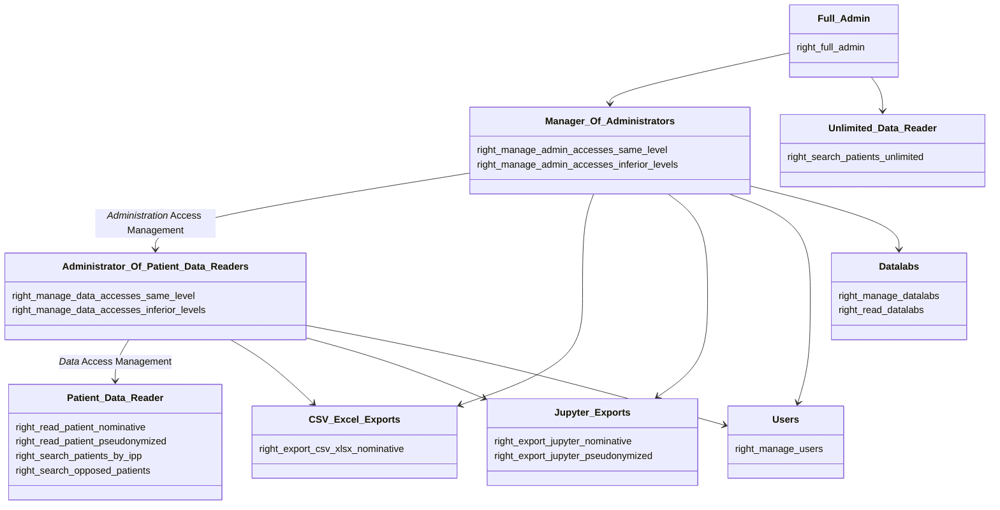
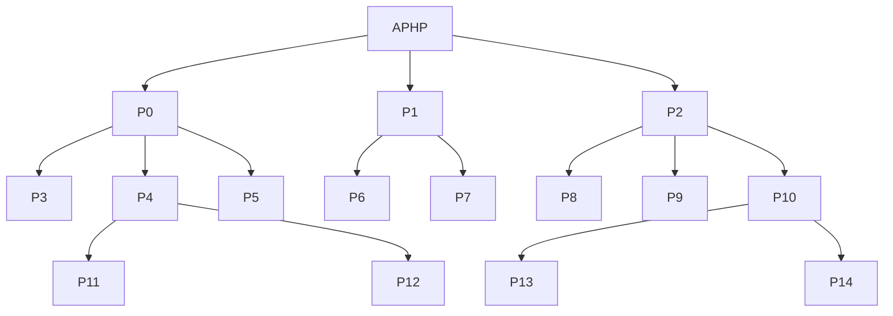

---
## Possible roles

#### Full_Admin role:
This is a **Super User** role. It allows managing/reading everything, including managing all kind of accesses.  
This role has the following right enabled:  
- *right_full_admin*  

> ⚠️  Only **one** Full Admin role is expected to be configured.

#### Patient_Data_Reader role:
It allows reading patient data either in nominative or in pseudonymized mode.  
It must have at least one of the following rights activated:  
- *right_read_patient_nominative*
- *right_read_patient_pseudonymized*

Furthermore, this role could be enhanced to access extra features by activating any of the following rights:
- *right_search_patients_by_ipp*
- *right_search_opposed_patients*
- *right_export_csv_xlsx_nominative*
- *right_export_jupyter_nominative*
- *right_export_jupyter_pseudonymized*

#### Unlimited_Data_Reader role:
A role having this right enables looking up patients in all perimeters without restrictions.  
Only the Full_Admin role is allowed to assign such a role to a user:  
- *right_search_patients_unlimited*  

#### Administrator_Of_Patient_Data_Readers role:
It allows to manage accesses associated with _Patient_Data_Reader_ roles:  
- *right_manage_data_accesses_same_level*
- *right_manage_data_accesses_inferior_levels*
- *right_manage_users*

> ⚠️  The rights granted by this role are dependent to the perimeters' hierarchy

#### Manager_Of_Administrators role:
It allows to manage accesses associated with _Administrator_Of_Patient_Data_Readers_ roles.  
- *right_manage_admin_accesses_same_level*
- *right_manage_admin_accesses_inferior_levels*
- *right_manage_users*

> ⚠️  The rights granted by this role are dependent to the perimeters' hierarchy

#### CSV_Excel_Exports role:
It allows to export data in CSV and XLSX formats.  
- *right_export_csv_xlsx_nominative*

> ⚠️  Exporting patient data in CSV or Excel format is only allowed in nominative mode (i.e. must have the **right_read_patient_nominative** enabled)

#### Jupyter_Exports role:
It allows to export data in Hive format to a Jupyter datalab or workspace.  
- *right_export_jupyter_nominative*
- *right_export_jupyter_pseudonymized*

> ⚠️  Having **right_export_jupyter_nominative** won't work unless the **right_read_patient_nominative** is enabled as well

#### Datalabs role:
It allows you to manage/read the list of Datalabs.  
- *right_manage_datalabs*
- *right_read_datalabs*

---

## Roles management

The rules of managing role are defined according to the following dependencies:  

  | If a Role has one of these rights                                                                                                                                                                                                                                                   | Managing it requires a Role having one of these rights                                                                                                                                                                     |
  |-------------------------------------------------------------------------------------------------------------------------------------------------------------------------------------------------------------------------------------------------------------------------------------|----------------------------------------------------------------------------------------------------------------------------------------------------------------------------------------------------------------------------|
  | right_full_admin OR   right_search_patients_unlimited OR   right_manage_admin_accesses_same_level OR  right_manage_admin_accesses_inferior_levels                                                                                                                       | right_full_admin                                                                                                                                                                                                           |
  | right_manage_users OR   right_manage_data_accesses_same_level OR   right_manage_data_accesses_inferior_levels OR   right_manage_datalabs OR   right_read_datalabs                                                         | right_full_admin  OR   right_manage_admin_accesses_same_level OR   right_manage_admin_accesses_inferior_levels                                                                                                     |
  | right_read_patient_nominative OR   right_read_patient_pseudonymized OR   right_search_patients_by_ipp OR   right_search_opposed_patients OR   right_export_csv_xlsx_nominative OR   right_export_jupyter_nominative OR   right_export_jupyter_pseudonymized | right_full_admin  OR   right_manage_admin_accesses_same_level OR   right_manage_admin_accesses_inferior_levels  OR   right_manage_data_accesses_same_level OR   right_manage_data_accesses_inferior_levels |

---

## Use cases

Given this perimeters hierarchy tree:  

### Basic examples:  
1. On perimeter `P1`:  
    * User X has a role of "Admin Access Manager on **inferior perimeters only**"
    * User Y has a role of "Data Access Manager on **inferior perimeters only**"

    > User X can manage accesses of user Y only if they are defined within inferior levels of `P1`   

2. On perimeter `P1`:  
    * User X has "Admin Access Manager on **same perimeter only**"
    * User Y has "Data Access Manager on **same perimeter only**"

    > User X can manage accesses of user Y as they are defined within the same perimeter `P1`   

3. mix:
    * User X has "Admin Access Manager on **inferior perimeters only**" on perimeter `P1`
    * User Y has "Data Access Manager on **same perimeter only**" on perimeter `P7`

    > User X can manage accesses of user Y as they are defined within an inferior perimeter of `P1`

### Listing user accesses

With respect to the hierarchy tree above, if user Y has some valid accesses defined as follows:  
  * On `P1`:  Data reader nominative
  * On `P4`:  Admin accesses manager (on same level + inf levels)
  * On `P10`: Data accesses manager (on same level + inf levels)

 | X roles                          | Result                                                                                                   |                                                                                                              
 |----------------------------------|----------------------------------------------------------------------------------------------------------|
 | Full Admin on `APHP`             | Can **manage** all 3 accesses of user Y                                                                  |
 | Admin Access Manager on `APHP`   | Can **manage** accesses defined within `P1` and P10. Access defined on `P4` is listed as **readonly**    |
 | Data Access Manager on `APHP`    | Can **manage** access defined within `P1`. Accesses defined on `P4` and `P10` are listed as **readonly** |
 | Data reader nominative on `APHP` | Can not read any of user Y's accesses                                                                    |