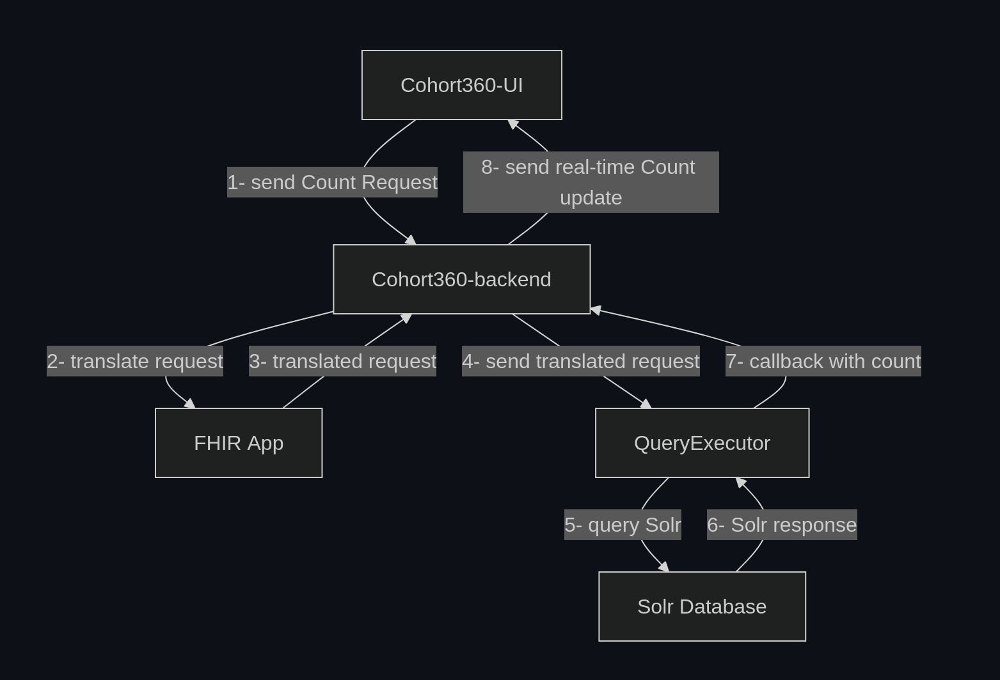
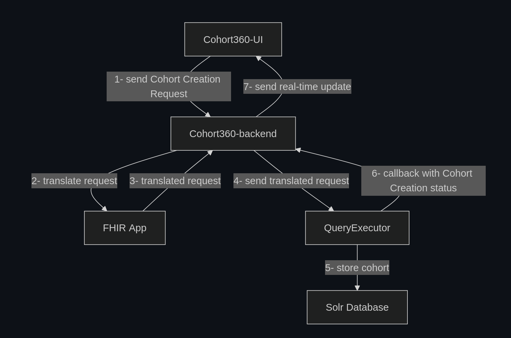
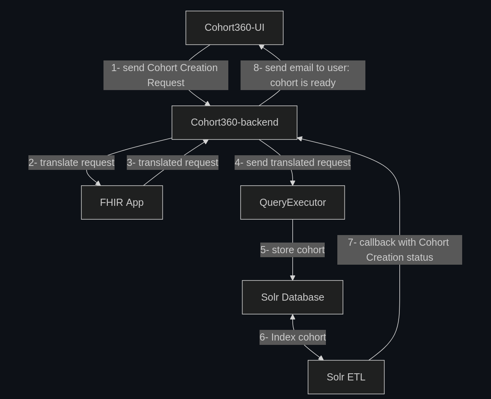

<a name="readme-top"></a>

<!-- PROJECT LOGO -->
<div align="center">


# Cohort360 Backend
<br />

[](https://github.com/aphp/Cohort360-Back-end/actions)
[](https://sonarcloud.io/dashboard?id=aphp_Cohort360-Back-end)


<br />
<a href="https://github.com/aphp/Cohort360-Back-end/issues/new">Report a bug</a>
·
<a href="CHANGELOG.md">What's new ?</a>
</div>

---


## Overview

**Cohort360-Backend** serves as the backend of two main web applications: [**Cohort360**](https://github.com/aphp/Cohort360) & [**Portail**](https://github.com/aphp/Cohort360-AdministrationPortal).  

#### 🔑 Features

- Native JWT based authentication
- Support for OIDC authentication
- Support for external authentication services
- Role & Perimeter based access management
- **Cohort360**'s requests versioning and cohort creation
- Real-time updates using web sockets
- Email-based notifications
- Manage data exports workflows; data can be exported in multiple formats: CSV, XLSX and Hive
- Web content management
- Toggle maintenance mode
- User impersonating for debugging
- Caching
- ...

#### 🛠️ Built With

* [Django](https://www.djangoproject.com)
* [Django REST Framework](https://www.django-rest-framework.org/)
* [DRF-spectacular](https://drf-spectacular.readthedocs.io/en/latest/)
* [Celery](https://docs.celeryproject.org/en/stable/)

---

## 📚 Project modules & environment variables

<details>
  <summary>🔹System</summary>

  **Cohort360-Backend** allows to choose which apps to run by making them figure in `INCLUDED_APPS`. This uses Django's [INSTALLED_APPS](https://docs.djangoproject.com/en/5.2/ref/settings/#std-setting-INSTALLED_APPS) setting key.
    

  | Variable              | Description                                                                                                                                                      | Default Value                                                          | Required ? |
  |-----------------------|------------------------------------------------------------------------------------------------------------------------------------------------------------------|------------------------------------------------------------------------|------------|
  | DJANGO_SECRET_KEY     | Assigned to Django's `SECRET_KEY` in [settings.py](admin_cohort/settings.py). Learn more [here](https://docs.djangoproject.com/en/5.2/ref/settings/#secret-key)  |                                                                        | `yes`      |
  | INCLUDED_APPS         | Comma-separated apps names to consider by Django registry.                                                                                                       | accesses,cohort_job_server,cohort,exporters,exports,content_management | no         |
  | DEBUG                 | Boolean to enable/disable debug mode. Make sure to set it to False in production                                                                                 | False                                                                  | no         |
  | ADMINS                | List of admin users to notify for errors. Used by Django's _AdminEmailHandler_.<br/>Multi-value variable ex: `Admin1,admin1@backend.fr;Admin2,admin2@backend.fr` |                                                                        | no         |
  | NOTIFY_ADMINS         | A boolean to allow sending error email notifications to `ADMINS`                                                                                                 | False                                                                  | no         |
  | BACKEND_HOST          | The backend host URL without the _http_ scheme                                                                                                                   | localhost:8000                                                         | no         |
  | FRONTEND_URL          | **Cohort360** frontend URL                                                                                                                                       | http://local-cohort360.fr                                              | no         |
  | FRONTEND_URLS         | Comma-separated frontend URLs. if defined, it must include the `FRONTEND_URL`                                                                                    | http://local-portail.fr,http://local-cohort360.fr                      | no         |
  | CELERY_BROKER_URL     | Broker URL. Defaults to using _redis_                                                                                                                            | redis://localhost:6379                                                 | no         |


  ### ⚠️ File-based logging Vs multiprocessing:  
  When **Cohort360-Backend** is running in multiprocessing mode (for example: using [Gunicorn](https://docs.gunicorn.org/en/latest/run.html) 
  with workers), sending logs to a file may result in race conditions and logs loss as each process tries to write to the log file.
    
  > Refer to Python docs for more insights
  >  - [Logging socket listener](https://docs.python.org/3.13/howto/logging-cookbook.html#running-a-logging-socket-listener-in-production)
  >  - [Logging events across a network](https://docs.python.org/3.13/howto/logging-cookbook.html#sending-and-receiving-logging-events-across-a-network)

  | Variable           | Description                                                                                                                                                              | Default Value | Required ? |
  |--------------------|--------------------------------------------------------------------------------------------------------------------------------------------------------------------------|---------------|------------|
  | SOCKET_LOGGER_HOST | Host URL to which the logs will be sent.<br/>Logs are currently sent to a [Network SocketHandler](https://docs.python.org/3/library/logging.handlers.html#sockethandler) | localhost     | no         |

</details>
 
<details>
  <summary>🔹Database</summary>

  A _PostgreSQL_ engine is used out of the box for **Cohort360-Backend**.  Refer to `DATABASES` in [settings.py](admin_cohort/settings.py) to set up a different engine.  
  > Learn more about [available engines](https://docs.djangoproject.com/en/5.2/ref/databases/).  
  
  The following variables are required to define the default database connection:  

  | Variable         | Description | Default Value  | Required ? |
  |------------------|-------------|----------------|------------|
  | DB_HOST          |             | localhost      | `yes`      |
  | DB_PORT          |             | 5432           | `yes`      |
  | DB_NAME          |             | cohort_db      | `yes`      |
  | DB_USER          |             | cohort_dev     | `yes`      |
  | DB_PASSWORD      |             | cohort_dev_pwd | `yes`      |

</details>

<details>
  <summary>🔹Authentication</summary>

  **Cohort360-Backend** uses _Json Web Tokens_ to authenticate requests and requires these variables:  

  | Variable        | Description                                                           | Default Value | Required ? |
  |-----------------|-----------------------------------------------------------------------|---------------|------------|
  | JWT_ALGORITHMS  | Comma-separated algorithms used to sign, encode and decode JWT tokens | RS256,HS256   | `yes`      |
  | JWT_SIGNING_KEY | Secret key used to sign JWT tokens                                    |               | `yes`      |

  Two authentication modes are supported:

   * Authentication using credentials _username/password_ (`default`)  
     For this, **Cohort360-Backend** tries validating user credentials in the following order:
        1. If there are third-party _authentication services_ configured, try them.
        2. Otherwise, fall back to **inplace authentication**: check if the user is registered in database and the provided password is valid
     
     > An external _authentication service_ may be for example an API that connects to an LDAP server under the hood.  
       💡 Refer to [this annex](.docs/authentication.md) for how to define hooks that use _external authentication services_   
       
   * OIDC authentication using one or multiple OIDC servers (`optional`)  
     Activate this mode by setting `ENABLE_OIDC_AUTH` to **True** (defaults to _False_)  
     > Note that **Cohort360-Backend** supports only `authorization_code` [grant type](https://auth0.com/docs/get-started/applications/application-grant-types#available-grant-types) for now

  | Variable               | Description                                                         | Default Value | Required ? |
  |------------------------|---------------------------------------------------------------------|---------------|------------|
  | OIDC_AUTH_SERVER_1     |                                                                     |               | `yes`      |
  | OIDC_REDIRECT_URI_1    |                                                                     |               | `yes`      |
  | OIDC_CLIENT_ID_1       |                                                                     |               | `yes`      |
  | OIDC_CLIENT_SECRET_1   |                                                                     |               | `yes`      |
  | OIDC_AUDIENCE          | comma-separated values of audience if multiple                      |               | `yes`      |
  | OIDC_EXTRA_SERVER_URLS | comma-separated URLs of other OIDC servers issuing tokens for users |               | no         |

  > 💡 **Tip**: You can configure a new server by adding extra variables: `OIDC_AUTH_SERVER_2`, `OIDC_REDIRECT_URI_2` ...

</details>

<details>
  <summary>🔹Cohort</summary>

  The **Cohort** app mainly allows to process _Cohort Count_ and _Cohort Creation_ requests  
  It interacts with a couple of **FHIR** and **QueryExecutor** instances to handle these requests in addition to a [Solr](https://solr.apache.org/)
  database being used behind the scenes.  
  * A _Cohort Count_ request consist of getting the number of patients matching a set of criteria (i.e. _get cohort size_).  
  * A _Cohort Creation_ request is about persisting the IDs of the patients included in a cohort for analysis or data export purposes.  
  
  
  ### Cohort Count Request

  
  
  ### Cohort Creation Request

  **Cohort360-Backend** can manage creating cohorts according to the number of included patients:  
  * If the cohort size is within `COHORT_SIZE_LIMIT`:  it gets created within a few minutes
  * Otherwise, it can take up to _24h_ to be ready as the process of creating it involves data indexation in the Solr database.  
    The `Solr ETL` entity then makes a callback to **Cohort360-Backend** to patch the cohort with its final status (_created_ or _failed_)

  #### 1. If cohort_size < `COHORT_SIZE_LIMIT`

  

  #### 2. If cohort_size > `COHORT_SIZE_LIMIT`

  


  The environment variables below are used to establish the architecture described before:  

  | Variable                | Description                                                                                                                         | Default Value | Required ?          |
  |-------------------------|-------------------------------------------------------------------------------------------------------------------------------------|---------------|---------------------|
  | FHIR_URL                | The URL of the server used to translate FHIR criteria to Solr format, ex: https://fhir.aphp.fr                                      |               | `yes`               |
  | QUERY_EXECUTOR_URL      | ex: https://query-executor.aphp.fr. the URL of your instance of [QueryExecutor](https://github.com/aphp/Cohort360-QueryExecutor)    |               | `yes`               |
  | QUERY_EXECUTOR_USERNAME | The system user of the QueryExecutor app. Used to make _patch_ calls on **Cohorts** and **Count Requests**                          |               | `yes`               |
  | QUERY_EXECUTOR_TOKEN    | Query Executor application API-key                                                                                                  |               | `yes`               |
  | USE_SOLR                | A boolean to indicate if a Solr database is used. If so, FHIR criteria are translated to Solr format                                | False         | no                  |
  | SOLR_ETL_USERNAME       | The system user of the Solr ETL app. Used to make _patch_ calls on Cohorts                                                          |               | `yes` if `USE_SOLR` |
  | SOLR_ETL_TOKEN          | ETL application API-key                                                                                                             |               | `yes` if `USE_SOLR` |
  | TEST_FHIR_QUERIES       | Weather to test queries before sending them to **QueryExecutor**                                                                    | False         | no                  |
  | LAST_COUNT_VALIDITY     | Validity of a _Count Request_ in hours. Passed this period, the request result becomes obsolete and the request must be re-executed | 24            | no                  |
  | COHORT_SIZE_LIMIT       | Maximum patients a "small" cohort can contain ("small" cohorts are created right away while big ones can take up to 24h)            | 20000         | no                  |

</details>

<details>
  <summary>🔹Perimeters</summary>

  Perimeters are meant to represent entities and/or departments, within a health institution, where patients are treated.  
  They can be of different types (CHU, Hospital, Unit Service ...) and are organized in tree-like structure with a single parent perimeter (**AP-HP** for the **Cohort360**).  

  In **Cohort360-Backend**, perimeters are used for two main purposes:  
  * Grant user accesses: a user is assigned a specific _Role_ over a _Perimeter_ for a period of time.
  * Run _Cohort Requests_: for example, fetch patients attached to one or multiple perimeters.
  
  | Variable                  | Description                                                                     | Default Value | Required ? |
  |---------------------------|---------------------------------------------------------------------------------|---------------|------------|
  | PERIMETER_TYPES           | comma-separated types of perimeters                                             |               | `yes`      |
  | ROOT_PERIMETER_ID         | ID of the root (parent) perimeter                                               |               | `yes`      |
  | REPORTING_PERIMETER_TYPES | comma-separated types of perimeters to include in the `FeasibilityStudy` report |               | no         |

    
  ### Perimeters retrieved from an external database
  If it is the case, perimeters can be synced using a periodic task.  
  For this, add **accesses_perimeters** to `INCLUDED_APPS` and set up a second database connection with the following variables: 

  > A periodic task is provided in the  [**accesses_perimeters**](accesses_perimeters/tasks.py) app for this purpose.  
    cf `SCHEDULED_TASKS` for configuration bellow.  
    
  | Variable                      | Description                  | Default Value | Required ? |
  |-------------------------------|------------------------------|---------------|------------|
  | PERIMETERS_SOURCE_DB_HOST     |                              |               | `yes`      |
  | PERIMETERS_SOURCE_DB_PORT     |                              |               | `yes`      |
  | PERIMETERS_SOURCE_DB_NAME     |                              |               | `yes`      |
  | PERIMETERS_SOURCE_DB_USER     |                              |               | `yes`      |
  | PERIMETERS_SOURCE_DB_PASSWORD |                              |               | `yes`      |
  | PERIMETERS_SOURCE_DB_SCHEMAS  | comma-separated schema names | _public_      | no         |

</details>

<details>
  <summary>🔹Data Exports</summary>

  If the **exporters** app is installed, the backend will allow to have data exported in the 
  following formats:
  * CSV files
  * XLSX files
  * To a Hive database

  For this, the following variables are required:
  
  | Variable                    | Description                                                                  | Default Value | Required ? |
  |-----------------------------|------------------------------------------------------------------------------|---------------|------------|
  | STORAGE_PROVIDERS           | Comma-separated URLs of servers to store exported data                       |               | `yes`      |
  | EXPORT_API_URL              | URL of the third-party API that handles exports                              |               | `yes`      |
  | EXPORT_API_AUTH_TOKEN       | API-key used for authentication                                              |               | `yes`      |
  | EXPORT_CSV_PATH             | Path to the directory where CSV exports are stored                           |               | `yes`      |
  | EXPORT_XLSX_PATH            | Path to the directory where XLSX exports are stored                          |               | `yes`      |
  | HADOOP_API_URL              | URL of a third-party API that handles creating the database for Hive exports |               | `yes`      |
  | HADOOP_API_AUTH_TOKEN       | API-key used for authentication                                              |               | `yes`      |
  | HIVE_DB_PATH                | Path to the directory where the Hive database is stored                      |               | `yes`      |
  | HIVE_USER                   | Name of the system user that creates Hive databases                          |               | `yes`      |
  | DISABLE_DATA_TRANSLATION    | If True, it disables translating exported data. Export data as is            | False         | no         |
  | DAYS_TO_KEEP_EXPORTED_FILES | Number of days to keep exported data available for download                  | 7             | no         |

</details>

<details>
  <summary>🔹Scheduled tasks</summary>

  **Cohort360-Backend** allows running scheduled tasks by providing task _name_, _function_ to execute and a _time_ of execution.  
  This uses Celery's [Periodic tasks](https://docs.celeryq.dev/en/stable/userguide/periodic-tasks.html).  
  > cf: `CELERY_BEAT_SCHEDULE` in [settings.py](admin_cohort/settings.py)
  

  | Variable         | Description                                                                                                     | Default Value | Required ? |
  |------------------|-----------------------------------------------------------------------------------------------------------------|---------------|------------|  
  | SCHEDULED_TASKS  | `;` separated tasks configurations in the following format:<br /> _task_name,module,function_name,hour,minutes_ |               | no         |

</details>

<details>
  <summary>🔹Emailing system</summary>

  To enable sending emails, Django's _EmailBackend_ needs the following parameters:
  
  | Variable              | Description                               | Default Value | Required ? |
  |-----------------------|-------------------------------------------|---------------|------------|
  | EMAIL_USE_TLS         |                                           | True          | `yes`      |
  | EMAIL_HOST            |                                           |               | `yes`      |
  | EMAIL_PORT            |                                           |               | `yes`      |
  | DEFAULT_FROM_EMAIL    | Email address of sender                   |               | `yes`      |
  | EMAIL_SUPPORT_CONTACT | Email address to contact the support team |               | no         |

</details>

<details>
  <summary>🔹Email alerts for expiring accesses</summary>

  **Cohort360-Backend** allows to frequently check users accesses validity and send email notifications for how to renew them.  
  To enable this behaviour, include the [_check_expiring_accesses_](accesses/tasks.py) task in `SCHEDULED_TASKS`.  
  > By default, two emails are sent `30` and `2` days respectively before accesses expiry date.

  | Variable                           | Description                                         | Default Value | Required ? |
  |------------------------------------|-----------------------------------------------------|---------------|------------|
  | ACCESS_EXPIRY_FIRST_ALERT_IN_DAYS  | Send first email X days before accesses expire      | 30            | no         |
  | ACCESS_EXPIRY_SECOND_ALERT_IN_DAYS | Send second email X days before accesses expire     | 2             | no         |
  | ACCESS_MANAGERS_LIST_LINK          | A link to a file with the list of accesses managers |               | no         |

</details>

<details>
  <summary>🔹Misc</summary>
  
  <details>
    <summary> ➖ Maintenances</summary>
  
  **Cohort360-Backend** allows activating _maintenance phase_ by restricting actions that change the state of the app.  
  With _maintenance phase_ activated, only the following actions are allowed:
  * **READ** actions (_GET_ requests on all resources)
  * Requests to `/auth/` such as login, logout and refresh_token
  * Requests to `/maintenances/` (to end the current maintenance phase for example)

  > For flexibility, the _maintenance phase_ can be activated with two modes:  
  > * **Partial**: as mentioned before, this allows to have the application running on _read-only_ mode.
  > * **Full**: this make the app entirely out of service.

  A cron job is configured to run by default every _one minute_ to check if a _maintenance phase_ is on progress. You can override this frequency by 
  modifying the `MAINTENANCE_PERIODIC_SCHEDULING_MINUTES` key in the [settings.py](admin_cohort/settings.py) file.  
  
  > For the **Cohort360** client, after each user login, a web socket connection is established allowing to send real-time updates regarding 
  > ongoing maintenances.

  </details>

  <details>
    <summary> ➖ Web content</summary>
  
  The backend has a mini application called `content_management` useful to stream info messages and warnings to be displayed on the **Cohort360** 
  UI.  
  
  By adding it to the `INCLUDED_APPS` environment variable, new endpoints `/webcontent/contents` become available to handle basic CRUD operations.

  </details>

  <details>
    <summary> ➖ Regex</summary>
  
  You can set optional regular expressions to validate usernames and email addresses

  | Variable       | Description                         | Default Value            | Required ? |
  |----------------|-------------------------------------|--------------------------|------------|
  | USERNAME_REGEX | A regex to validate usernames       | (.*)                     | no         |
  | EMAIL_REGEX    | A regex to validate email addresses | ^[\w.+-]+@[\w-]+\.[\w]+$ | no         |
  
  </details>
  
  <details>
    <summary> ➖ Caching responses</summary>
  
  The backend uses _RedisCache_ from the **django_redis** package.  
  Extra tuning parameters to control cache validity are defined in [settings.py](admin_cohort/settings.py)

  | Variable     | Description                   | Default Value | Required ? |
  |--------------|-------------------------------|---------------|------------|
  | ENABLE_CACHE | Enable caching HTTP responses | False         | no         |
    
  </details>

  <details>
    <summary> ➖ Store diagnosis data on InfluxDB</summary>
  
  You can configure an InfluxDB connection to store response times of the API endpoints and plug in a monitoring tool like Grafana.  
  > this activates a new middleware on top of the existing ones to track requests process time.

  Start by adding the variable `INFLUXDB_ENABLED` set to **True** in addition to the following: 
  
  | Variable              | Description         | Default Value | Required ? |
  |-----------------------|---------------------|---------------|------------|
  | INFLUXDB_URL          | InfluxDB server URL |               | `yes`      |
  | INFLUXDB_ORG          | Organization name   |               | `yes`      |
  | INFLUXDB_BUCKET       | Bucket name         |               | `yes`      |
  | INFLUXDB_DJANGO_TOKEN | InfluxDB API-key    |               | `yes`      |
  
  </details>
</details>

<div align="right">
  ⬆️ <a href="#readme-top">back to top</a>
</div>

---

## 🚀 Project setup

### 1. 📥 Get the code

   ```sh
   git clone https://github.com/aphp/Cohort360-Back-end.git
   ```

### 2. 🔧 Configuration

  1. Create a **.env** file in the _admin_cohort_ directory following the **.setup/.env.example** template  
  🔆 More insights on environment variables above.
   ```sh
   cp .setup/.env.example admin_cohort/.env
   ```

  2. Create a **perimeters.csv** file in the _.setup_ directory following the **.setup/perimeters.example.csv** format
   ```sh
   cp .setup/perimeters.example.csv .setup/perimeters.csv
   ```

### 3. Setup

   🔶 Note that the _setup.sh_ script needs root privileges to run some commands

   ```sh
   bash .setup/setup.sh
   ```
  All set up 🎉  
  
* The development server is running on port `8000` and the Swagger UI for endpoints documentation is found at: [localhost:8000/docs](http://localhost:8000/docs)
* Once on the Swagger UI, start by getting an authentication **token** by logging in using the `/auth/login/` endpoint. Use that token for 
  authorization.

<div align="right">
  ⬆️ <a href="#readme-top">back to top</a>
</div>

---

## 🤝 Contributing

See [CONTRIBUTING.md](CONTRIBUTING.md) for detailed process about contributing to this repository.

## 📜 License

This project is licensed under the Apache License - see the [LICENSE](LICENSE) file for details.

## 💬 Contact

If you find this project useful, please consider starring the repository and report any encountered bugs or issues.  
Write to us at: **open-source@cohort360.org**

<div align="right">
  ⬆️ <a href="#readme-top">back to top</a>
</div>