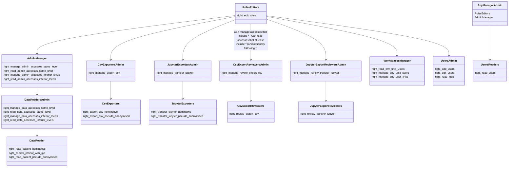
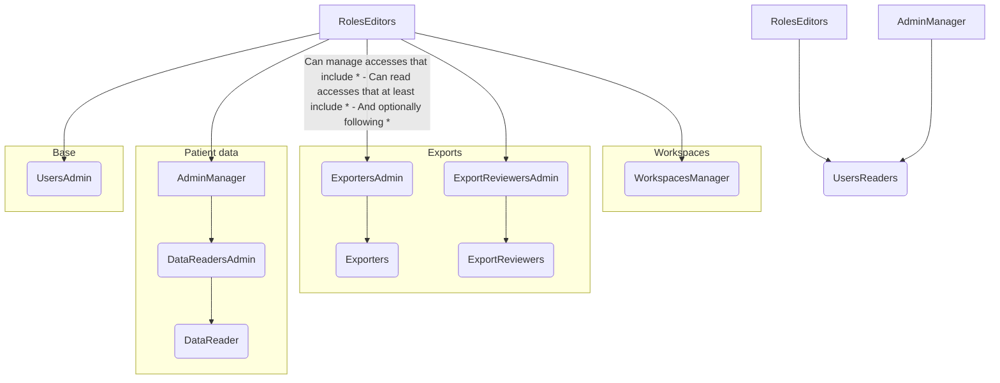

Comment lire ce schéma :

#### Manage

Imaginons un *Role* qui possède:
- *right_export_csv_nominative*  (**Exporters**)
- *right_manage_env_unix_users* (**WorkspacesManager**)
- *right_read_data_accesses_same_level* (**DataReadersAdmin**)

Et bien pour pouvoir attribuer ce *Role* a quelqu'un, ou modifier un *Access* qui possède ce *Role*, il faut que moi-même j'ai un Role avec :
- *right_manage_export_csv* (**ExportersAdmin**)
- *right_edit_roles* (**RolesEditors**)
- *right_manage_admin_accesses_* (**AdminManager**)

Et en effet, *right_edit_roles* **ne suffit pas** pour créer un accès avec *right_read_data_accesses_same_level* (**DataReadersAdmin**)

#### Read

En revanche, côté lecture, lorsque je fais `GET /accesses/`, s'afficheront les _Access_ avec _Role_ qui :
- possède **au moins** un _right_ de niveau directement en-dessous de mon *Role* dans le graphe
- possède **éventuellement** des _right_ de niveau encore en-dessous
- ne possède **aucun** _right_ de de mon type de _Role_ ou de _Role_ de niveau supérieur

Par exemple, si je possède _right_read_admin_accesses_ (**AdminManager**):
- apparaîtront les _Access_ avec un _Role_ contenant uniquement _right_manage_data_accesses_same_level_ (**DataReadersAdmin**) et _right_read_users_ (**UsersReaders**)
- ils apparaîtront encore si je rajoute, à ce _Role_, _right_read_patient_nominative_ (**DataReaders**) 
- n'apparaîtront plus si je rajoute, à ce _Role_, _right_read_admin_accesses_ (**DataReaders**), _right_export_csv_nominative_ (**Exporters**) ou même pire _right_edit_roles_ (**RolesEditors**)
