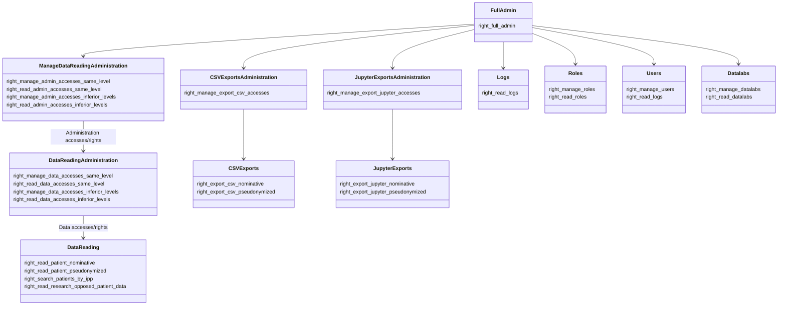

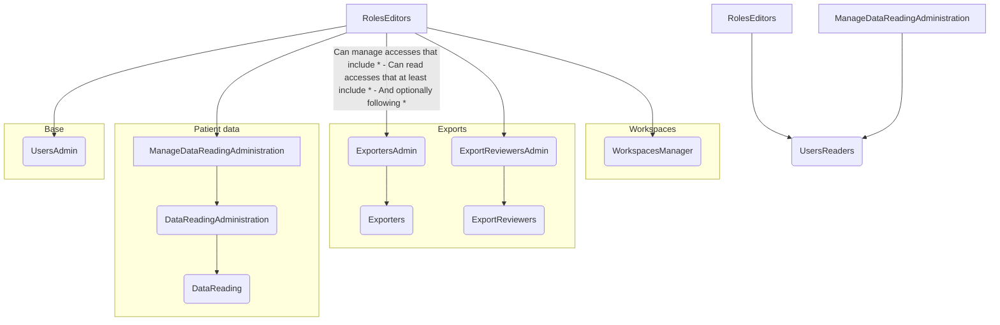

Comment lire ce schéma :

#### Manage

Imaginons un *Role* qui possède:
- *right_export_csv_nominative*  (**Exporters**)
- *right_manage_datalabs* (**WorkspacesManager**)
- *right_read_data_accesses_same_level* (**DataReadingAdministration**)

Et bien pour pouvoir attribuer ce *Role* a quelqu'un, ou modifier un *Access* qui possède ce *Role*, il faut que moi-même j'ai un Role avec :
- *right_manage_export_csv* (**ExportersAdmin**)
- *right_manage_roles* (**RolesEditors**)
- *right_manage_admin_accesses_* (**ManageDataReadingAdministration**)

Et en effet, *right_manage_roles* **ne suffit pas** pour créer un accès avec *right_read_data_accesses_same_level* (**DataReadingAdministration**)

#### Read

En revanche, côté lecture, lorsque je fais `GET /accesses/`, s'afficheront les _Access_ avec _Role_ qui :
- possède **au moins** un _right_ de niveau directement en-dessous de mon *Role* dans le graphe
- possède **éventuellement** des _right_ de niveau encore en-dessous
- ne possède **aucun** _right_ de de mon type de _Role_ ou de _Role_ de niveau supérieur

Par exemple, si je possède _right_read_admin_accesses_ (**ManageDataReadingAdministration**):
- apparaîtront les _Access_ avec un _Role_ contenant uniquement _right_manage_data_accesses_same_level_ (**DataReadingAdministration**) et _right_read_users_ (**UsersReaders**)
- ils apparaîtront encore si je rajoute, à ce _Role_, _right_read_patient_nominative_ (**DataReaders**) 
- n'apparaîtront plus si je rajoute, à ce _Role_, _right_read_admin_accesses_ (**DataReaders**), _right_export_csv_nominative_ (**Exporters**) ou même pire _right_manage_roles_ (**RolesEditors**)

### Exemples

Considérons un schéma simplifié des droits :

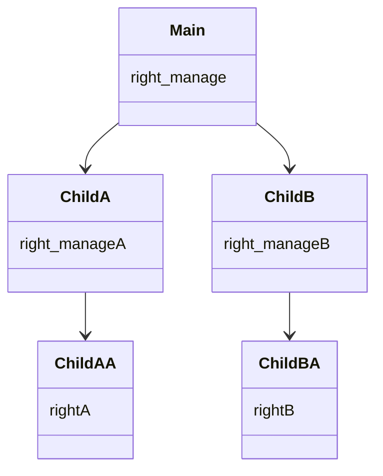

Pour simplifier encore, nous considérerons 

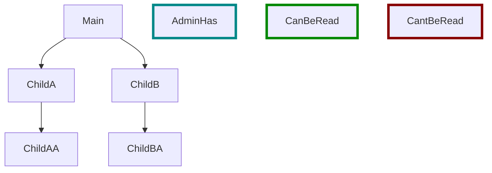

Attention, on considère :
- qu'avoir ChildA signifie qu'on a right_read_accesses dans le cas de la lecture, et right_edit_accesses dans l'autre cas.
- uniquement les droits, et non les Périmètres (dans le cas de right_read_accesses_on_inferior_levels)

#### Lecture

##### Cas 1

Si admin possède :

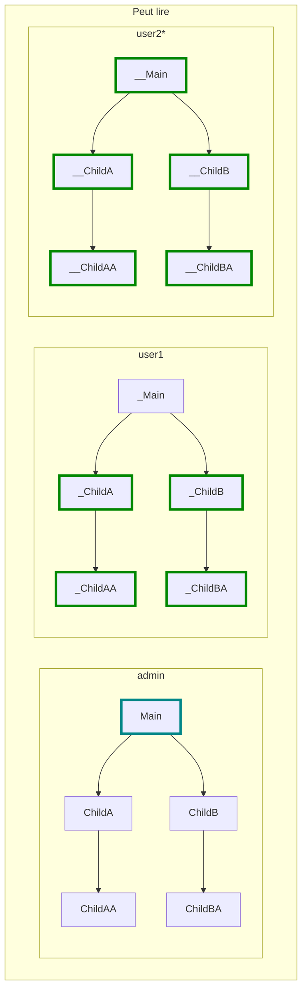

*parce que Main n'a pas de parent, il doit pouvoir se lire lui même.

Mais ne pourra pas lire le suivant :

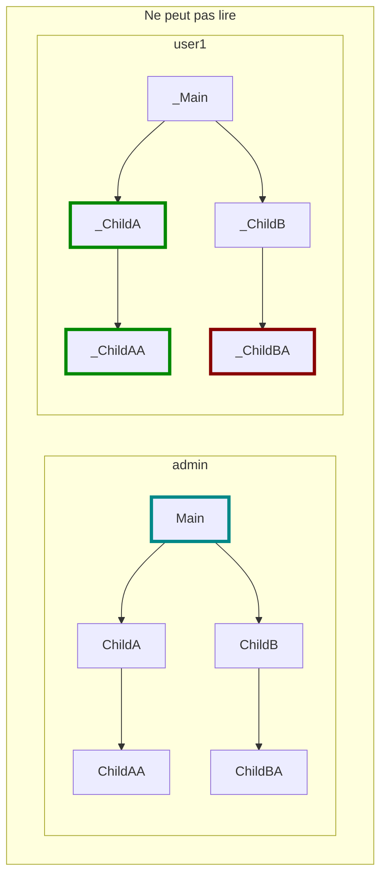

Car il manque dans ChildB pour lire les droits enfants.

##### Cas 2

Si admin possède ceci :

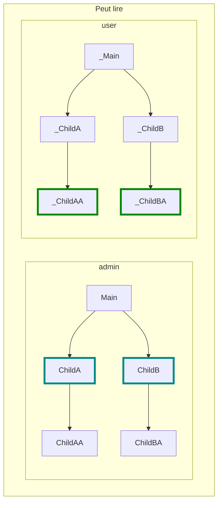

Mais :

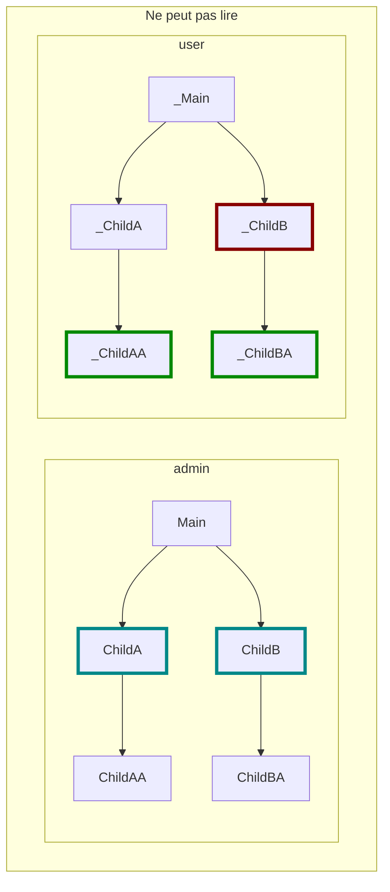

##### Cas 3

Et si admin n'a que :

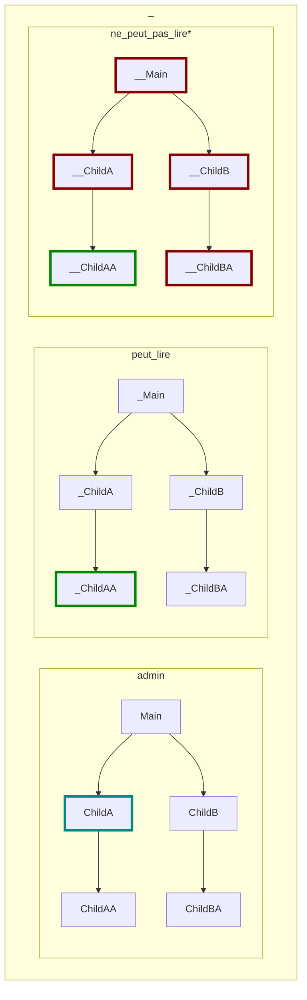

*Le cas 2 ne peut être lu si un seul des droits rouges est Vrai dans ce rôle.

#### Ecriture

Ici, le droit est moins permissif. ChildA permet de créer un accès à un Role qui contient uniquement les droits des enfants directs.

Nous aurons ainsi :

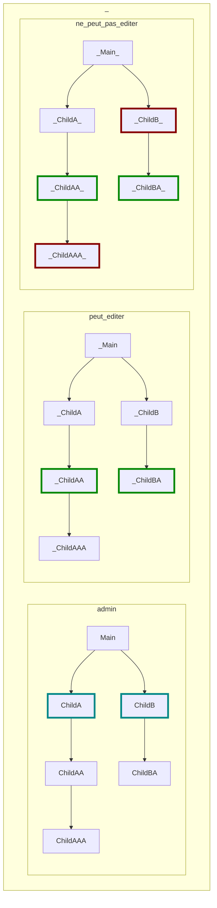

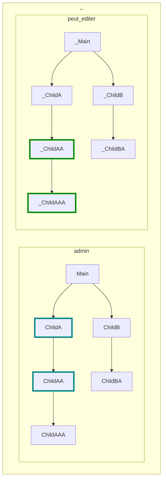

On conserve le cas particulier d'un droit n'ayant pas de parent :

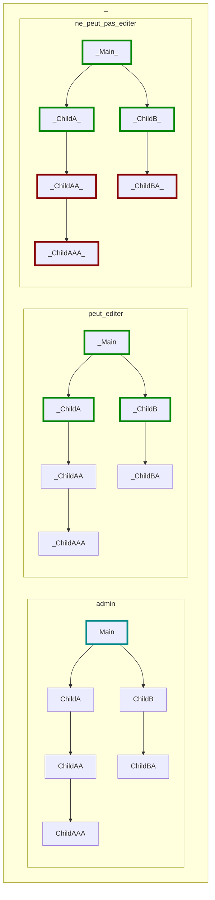

#### Cas particulier de right_read_users

right_read_users devrait être attribuable/attribué avec n'importe quel Role pouvant gérer un accès qui lui-même gère un accès.

Ceci est vrai pour **Lecture** et **Ecriture**.

Exemple :

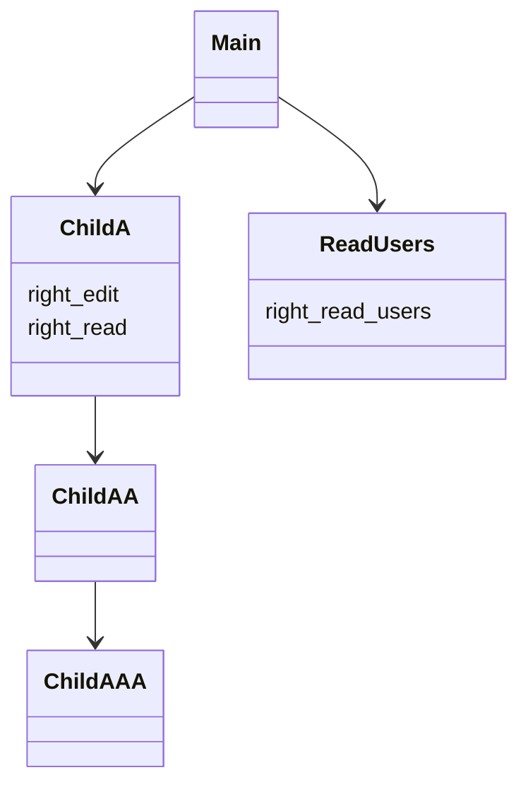

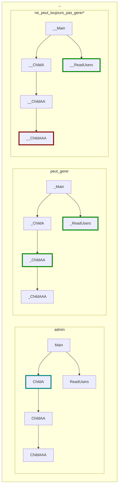

*car ChildAAA n'est pas vivible sans __ChildAA

Mais :

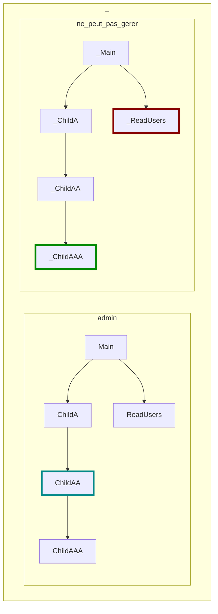

Car ChildAAA ne permet pas de gérer d'autres accès.

### Traitement du cas avec périmètres

Considérons un modèle un petit peu plus complet :

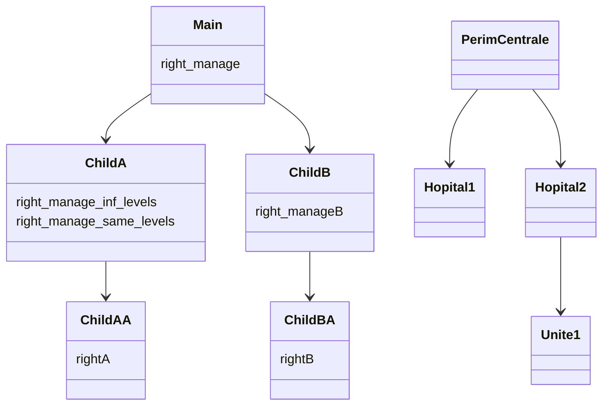

Lorsqu'un groupe de droits ne possède pas de inf/same level, cela veut dire que sont right_manage est valable sur TOUS les périmètres.

Nous pouvons avoir des cas comme ceci :

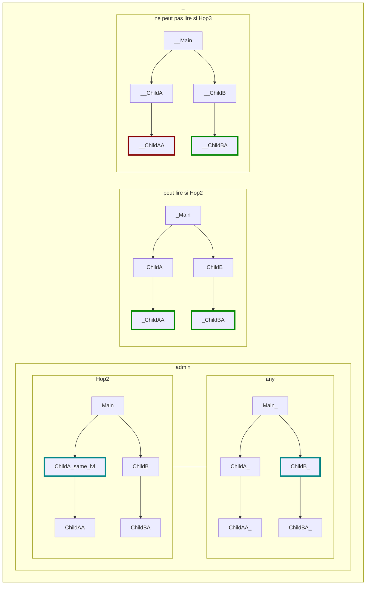

