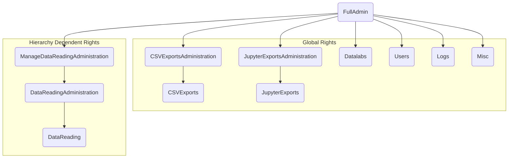
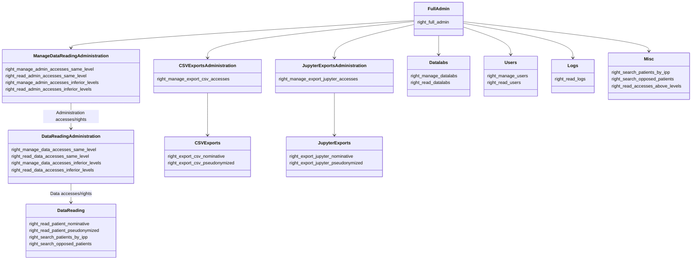

## 
## ℹ️ Tout droit de gestion d'accès permet implicitement la lecture

#### Full Admin Role:
Super User, Il permet de tout faire, notamment de gérer tous les accès.  
c'est tout Role ayant le droit suivant activé:
- *right_full_admin*
Il faudra configurer **un et un seul** rôle Full Admin.

#### Data Reading Role:
Il permet de consulter les données patient et rechercher par IPP et consulter les données des patients opposés.  
c'est tout Role ayant au moins un des droits suivants activé:  
- *right_read_patient_nominative*
- *right_read_patient_pseudonymized*
- *right_search_patients_by_ipp*
- *right_search_opposed_patients*

#### Data Reading Administration Role:
Il permet de gérer/consulter les accès attachés à des Data Reading Role.  
c'est tout Role ayant au moins un des droits suivants activé:  
- *right_manage_data_accesses_same_level*
- *right_read_data_accesses_same_level*
- *right_manage_data_accesses_inferior_levels*
- *right_read_data_accesses_inferior_levels*

#### Manage (Data Reading Administration) Role:
Il permet de gérer/consulter les accès attachés à des Data Reading Administration Role.  
c'est tout Role ayant au moins un des droits suivants activé:  
- *right_manage_admin_accesses_same_level*
- *right_read_admin_accesses_same_level*
- *right_manage_admin_accesses_inferior_levels*
- *right_read_admin_accesses_inferior_levels*

#### CSV Exports Role:
Il permet de réaliser des exports de données en format CSV.  
c'est tout Role ayant au moins un des droits suivants activé:  
- *right_export_csv_nominative*
- *right_export_csv_pseudonymized*

#### Jupyter Exports Role:
Il permet de réaliser des exports de données en format Jupyter.  
c'est tout Role ayant au moins un des droits suivants activé:  
- *right_export_jupyter_nominative*
- *right_export_jupyter_pseudonymized*

#### Logs Reading Role:
Il permet de consulter les logs sur le Portail.  
c'est tout Role ayant le droit suivant activé:  
- *right_read_logs*

#### User Role:
Il permet de gérer/consulter la liste des utilisateurs.  
c'est tout Role ayant au moins un des droits suivants activé:  
- *right_manage_users*
- *right_read_users*

#### Datalabs Role:
Il permet de gérer/consulter la liste des Datalabs.  
c'est tout Role ayant au moins un des droits suivants activé:  
- *right_manage_datalabs*
- *right_read_datalabs*
