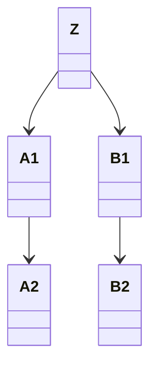
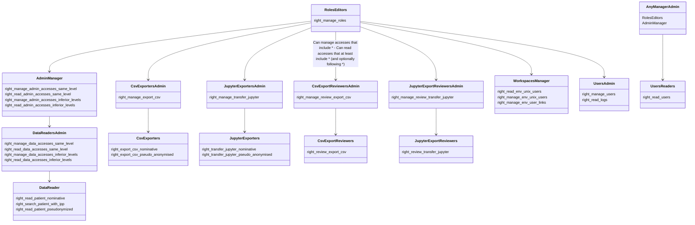
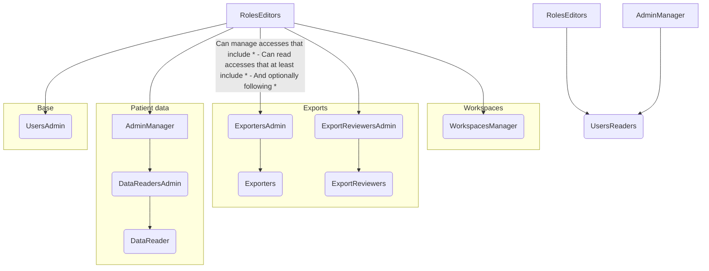

## Description des permissions

### Résumé du modèle de données

Le modèle de données comportent 5 objets principaux.
- _Perimeter_: lieu auquel sont liées des données. Avoir accès à ce CareSite, c'est avoir accès à ces données.
- _Access_: littéralement un historique d'un CareSite auquel un utilisateur a été lié, autrement dit un accès à un CareSite délimité dans le temps
- _Profile_: un état d'un _User_, lié à une liste d'_Accesses_, et défini par une _source_ (_manual_, _application x_, etc.)
- _Role_: un profile Profile est lié temporairement à un ensemble de données CareSite via un accès Access. Le type de cet accès est défini par le Role auquel l'accès est lié. Par exemple, le Role définit si l'utilisateur a le droits aux données pseudo-anonymisées ou nominative du CareSite.

### Type d'accès
_Mis à jour le 2 Avril 2021_

#### Les droits

#### Les étendus

Les droits cités précédemment portent effet sur certains Profile, certains CareSite, et certains Role.

##### Etendu côté CareSite

Lorsqu'un droit porte sur un CareSite, l'utilisateur peut utiliser ce droit sur les CareSites auxquels il est lié via un
 Access portant un Role comprenant ce droit, ainsi que les CareSites sous-jacents à ceux-ci.
Sauf si ce droit (notamment pour les Gestions d'accès) est spécifié sur "même CareSite" ou sur "CareSites inférieur", "inférieur" étant considéré comme strict.

##### Etendu côté Profile

Quand un droit porte sur des Profile (édition utilisateur, Ajout/édition accès, etc.), la globalité des 
Profile peuvent être impactés. L'édition utilisateur est donc un droit fort, et un admin pouvant créer un accès 
peut donner accès à n'importe quel Profile existant dans la base OMOP.portail. Toutefois, les accès créés ne seront que sur 
un Profile de source MANUAL.

##### Etendu côté Role

5 grands types de droits :
- accès données: permettant à un utilisateur de lire certaines données OMOP (Lecture Patient, etc.)
- accès Admin OU gestion des accès données: permet les actions avec des Roles comprenant les droits accès données
- Admin Manager / gestion des accès Admin: permet les actions avec des Roles comprenant les droits accès Admin
- gestion Utilisateurs: permet l'édition des Profils ayant un accès sur le CareSite correspondant, ou bien la création de nouveaux avec ou sans Provider existant (dans le cas 2, créera un nouveau Provideraprès vérification de l'ID aph)
- gestion des rôles: droit ultime permettant d'ajouter/modifier des Role, ainsi que les actions avec des Roles comprenant les droits Admin Manager

En parallèle, 2 types de droits annexes, indépendants des CareSites auxquels un Accès les lie :
- accès Action Données : permet à l'utilisateur une action sur des données OMOP (export, transfert, etc.), en fonction des CareSites sur lesquels l'utilisateur possède un accès données
- accès Action Générale : permet à l'utilisateur une action spécifique telle que la validation de demande de transfert de données
- accès Admin Action : permet de donner un utilisateur un accès Action Données ou Action Générale

#### Spécifications pour les lectures

Les accès concernant des droits de type Données et aucun autre :
- lus par right_read_data_accesses_same_level / right_read_data_accesses_inferior_levels

Les accès concernant des droits de type Admin avec, ou non, Données mais aucun autre : 
- lus par right_read_admin_accesses_same_level / right_read_admin_accesses_inferior_levels

Les accès concernant des droits de type Action Validation ou Action Données : lus par 
- right_manage correspondant (Ex.: _right_manage_review_transfer_jupyter_ pour lire _right_review_transfer_jupyter_request_)
- right_read_admin_accesses_same_level/inferior_levels.

Les accès concernant au moins un droit de type _Rôles_, _Logs_, _Actions Admin_, _User Admin_ (sans read_users) ou _AdminManager_ avec, ou non, _ADMIN_ et/ou _Données_ mais aucun autre : 
- lus par right_manage_roles

#### Spécifications pour les éditions

##### Limites de l'édition des dates startDate et endDate

Le modèle Access possède des dates de début et fin de validité.
Permettre à l'utilisateur d'indiquer n'importe quelles dates pourraient engendrer des données faussées lorsque l'on veut
 déterminer si un utilisateur à eu un accès à une date précise (si après que l'accès soit arrivée à terme, on change la 
 période par exemple).
Les restrictions sont donc les suivantes :
- si startDate ou endDate est déjà passée, je ne peux pas les modifier
- le nouveau startDate ou endDate ne peut pas être dans le passé (avant maintenant)

Aussi, lors de la création du Access, ne pas fournir de startDate le définira automatiquement à now().
Une clé api permettant de fermer un Access permettra de définir endDate à now().

##### Les champs manual_

Le modèle Access possède les champs manual_startDate et manual_endDate.
Lors de la création d'un accès manuellement via la console et lors de l'édition d'un accès, seuls les champs manual_ 
peuvent être modifiés. Ce sont ceux-là qui seront lus en priorité par Console.
Cela permet de garder l'information startDate et endDate indiqué par les ETL qui indiquent automatiquement des accès et 
qui metront à jour quotidiennement ces champs.

Ainsi, manual_start = None signifie : aucun administrateur n'a corrigé ce Access.

En revanche, manual_end = None peut signifier plusieurs choses :
- l'administrateur n'a pas programmé de date de fin, l'accès est donc valide de ce côté là
- l'administrateur n'a pas corrigé l'accès, la valeur automatique est donc celle qui est valable
- l'administrateur a corrigé l'accès, en enlevant délibérément la limite de fin de l'accès

Pour parer cela, la Console refusera de modifié un end_date pour la mettre à null. 
Si c'est le cas lors d'une création, la end_date par défaut sera un an après la start_date.

Si end_date est modifié (mis à null ou une valeur autre), Console va alors refuser un champ start_date vide ou nul.
Le front-end a donc intérêt à proposer de valider les deux dates par l'utilisateur lors d'une modification.

Pour considérer un accès comme valide, voici ce que la Console regardera:
- start:
  - manual_start = None ET (start < now OU start = None)
  - OU manual_start < now
- ET end:
  - manual_end = None ET manual_start = None ET (end > now OU end = None)
  - OU manual_end = None ET manual_start != None
  - OU manual_end > now

#### Règles pour la création de Role

Ces règles sont déduites du système décrit ci-dessus :
- un Role ayant des droits de type accès données, ne devrait pas avoir des droits de type Ajout/Edition sur les autres types de droits, car sinon: **les droits de type Admin ne pourront pas les altérer**
- un Role ayant des droits de type admin, ne devrait pas avoir des droits de type Ajout/Edition sur les droits Admin, car sinon: **les droits de type gestion d'Admin ne pourront pas les altérer**
- pour un Role, quelque soit le type de droits concerné, le droit Ajout devrait impliquer le droit Edition
- pour un Role, Lecture Accès Admin et Lecture Accès Données devrait impliquer le droit Lecture Utilisateur

En simplifié :
- accès données => ~~accès admin~~ && ~~gestion accès admin~~
- accès admin => ~~gestion accès admin~~
- Ajout => Edition
- Lecture Accès => Lecture Utilisateur

#### Exemple de tableau

|                       | Edition roles | Lecture logs | Ajout utilisateur | Edition utilisateur | Lecture utilisateur | Edition accès admin | Lecture accès admin |   Edition accès admin   | Lecture accès admin | Edition accès données | Lecture accès données |  Edition accès données  | Lecture accès données | Lecture patient nomin | Lecture patient pseudo | Manage review export CSV | Review export CSV request | Manage export csv | Export CSV Nomin | Export CSV Pseudo |
|-----------------------|:-------------:|:------------:|:-----------------:|:-------------------:|:-------------------:|:-------------------:|:-------------------:|:-----------------------:|:-------------------:|:---------------------:|:---------------------:|:-----------------------:|:---------------------:|:---------------------:|:----------------------:|:------------------------:|:-------------------------:|:-----------------:|:----------------:|------------------:|
|                       |               |              |                   |                     |                     |  <-- même CareSite  |        ---->        | <--CareSites inférieurs |        ---->        |   <-- même CareSite   |         ---->         | <--CareSites inférieurs |         ---->         |                       |                        |                          |                           |                   |                  |                   |
| Administrateur global |       x       |      x       |         x         |          x          |          x          |          x          |          x          |            x            |          x          |                       |                       |                         |                       |                       |                        |                          |                           |                   |                  |                   |
| Administrateurs CSRI  |               |              |         x         |          x          |          x          |  x (sous-CareSite)  |  x (sous-CareSite)  |    x (sous-CareSite)    |  x (sous-CareSite)  |           x           |           x           |            x            |           x           |                       |                        |                          |                           |                   |                  |                   |
| Référent GH           |               |              |                   |                     |          x          |                     |                     |                         |                     |           x           |           x           |            x            |           x           |                       |                        |                          |                           |         x         |                  |                   |
| Sous-référents GH     |               |              |                   |                     |          x          |                     |                     |                         |                     |           x           |           x           |            x            |           x           |                       |                        |                          |                           |                   |                  |                   |
| Chercheur A           |               |              |                   |                     |                     |                     |                     |                         |                     |                       |                       |                         |                       |                       |           x            |                          |                           |                   |                  |                 x |
| Chercheur B           |               |              |                   |                     |                     |                     |                     |                         |                     |                       |                       |                         |                       |                       |           x            |                          |                           |                   |                  |                   |
| Chercheur C           |               |              |                   |                     |                     |                     |                     |                         |                     |                       |                       |                         |                       |           x           |                        |                          |                           |                   |                  |                   |
| Chercheur D           |               |              |                   |                     |                     |                     |                     |                         |                     |                       |                       |                         |                       |           x           |                        |                          |                           |                   |        x         |                   |
| Médecin               |               |              |                   |                     |                     |                     |                     |                         |                     |                       |                       |                         |                       |           x           |                        |                          |                           |                   |                  |                   |
| Référent export       |               |              |                   |                     |                     |                     |                     |                         |                     |                       |                       |                         |                       |           x           |                        |            x             |             x             |                   |                  |                   |

Comment lire ce schéma :

#### Manage

Imaginons un *Role* qui possède:
- *right_export_csv_nominative*  (**Exporters**)
- *right_manage_env_unix_users* (**WorkspacesManager**)
- *right_read_data_accesses_same_level* (**DataReadersAdmin**)

Et bien pour pouvoir attribuer ce *Role* a quelqu'un, ou modifier un *Access* qui possède ce *Role*, il faut que moi-même j'ai un Role avec :
- *right_manage_export_csv* (**ExportersAdmin**)
- *right_manage_roles* (**RolesEditors**)
- *right_manage_admin_accesses_* (**AdminManager**)

Et en effet, *right_manage_roles* **ne suffit pas** pour créer un accès avec *right_read_data_accesses_same_level* (**DataReadersAdmin**)

#### Read

En revanche, côté lecture, lorsque je fais `GET /accesses/`, s'afficheront les _Access_ avec _Role_ qui :
- possède **au moins** un _right_ de niveau directement en-dessous de mon *Role* dans le graphe
- possède **éventuellement** des _right_ de niveau encore en-dessous
- ne possède **aucun** _right_ de de mon type de _Role_ ou de _Role_ de niveau supérieur

Par exemple, si je possède _right_read_admin_accesses_ (**AdminManager**):
- apparaîtront les _Access_ avec un _Role_ contenant uniquement _right_manage_data_accesses_same_level_ (**DataReadersAdmin**) et _right_read_users_ (**UsersReaders**)
- ils apparaîtront encore si je rajoute, à ce _Role_, _right_read_patient_nominative_ (**DataReaders**) 
- n'apparaîtront plus si je rajoute, à ce _Role_, _right_read_admin_accesses_ (**DataReaders**), _right_export_csv_nominative_ (**Exporters**) ou même pire _right_manage_roles_ (**RolesEditors**)
